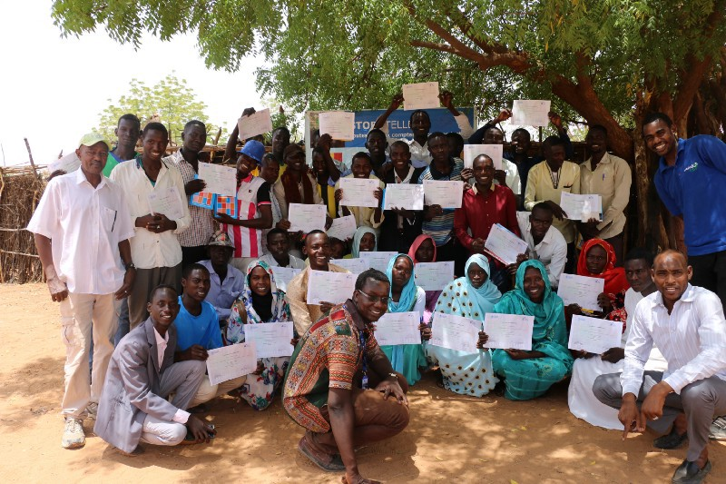

```{r setup, include=FALSE}
knitr::opts_chunk$set(echo = FALSE, warning = FALSE)

library(haven)
library(labelled)
library(tidyverse)
library(RColorBrewer)
library(kableExtra)
library(flextable)
library(spatstat)
library(sf)
library(extrafont)


#import processed data set
CAR_201911_ENSAproccessedHH_external <- read_sav("3_ProcessedData/CAR_201911_ENSAproccessedHH_external.sav")

#create codebook
codebook:::label_browser_static(CAR_201911_ENSAproccessedHH_external)

#convert labels 
data <- to_factor(CAR_201911_ENSAproccessedHH_external)

#rename CH/IPC and CARI variables
data <- data %>% rename(
#geo and demographics
  adm1_name = q1.1,
  hhhsex = q2.1,
  hhhedu = q2.4,
  hhstatus = q3.1,
  hhshocktypefirst =  q9.2.a,
  hhincfirst = q7.1a,
#CARI
  fcscat21 = GCA,
  max_coping_behaviour = Max_coping_behaviour,
  foodexp_4pt = Foodexp_4pt,
#CH
  rcsi = rCSI,
  hdds = HDDS,
  #HHS, not here
  fs_final = FS_final,
#subindicators
  #rcsi
  rcsilessqlty = q10.1,
  rcsiborrow = q10.2,
  rcsimealnb = q10.3,
  rcsimealsize = q10.5,
  rcsimealadult = q10.4,
  #fcg
  #lhcs
#weight
weighthh = hh_weight
)


#rename CH/IPC and CARI values - how to make french and english labels??
data <- data %>% mutate(fcscat21 = recode(fcscat21, 
                                          "Consommation Pauvre" = "poor",
                                          "Consommation Limite" = "borderline",
                                          "Consommation Acceptable" = "acceptable"),
                        max_coping_behaviour = recode(max_coping_behaviour,
                                          "HH not adopting coping strategies" = "HH not adopting coping strategies",
                                          "Stress coping strategies" = "Stress coping strategies",
                                          "crisis coping strategies" = "Crisis coping strategies",
                                          "emergencies coping strategies" = "Emergency coping strategies"),
                        foodexp_4pt = recode(foodexp_4pt,
                                          "Moins de 50% des dépenses consacrées à la nourriture" = "Less than 50% of income  spent on food",
                                          "50% à 65% des dépenses consacrées à la nourriture" = "Between 50% - 65% of income spent on food",
                                          "65% à 75% des dépenses consacrées à la nourriture" = "Between 65% - 75% of income spent on food",
                                          "75% ou plus des dépenses consacrées à la nourriture" = "More than 75% of income spent on food"),
                        fs_final = recode(fs_final,   
                                          "Food secure" = "Food secure",
                                          "Marginally food secure" = "Marginally food secure",
                                          "Moderately food insecure" = "Moderately food insecure",
                                          "Severely food insecure" = "Severely food insecure"))

#create theme
#make x and y axis blank, put legend in bottom
theme_vamgraphs <- function(){ 
    font <- "Open Sans"   #assign font family up front
    theme_minimal() %+replace%    #replace elements we want to change
    theme(
      #grid elements
      panel.grid.major = element_blank(),    #strip major gridlines
      panel.grid.minor = element_blank(),    #strip minor gridlines
      axis.ticks = element_blank(),          #strip axis ticks
      axis.title.x = element_blank(),
      axis.title.y = element_blank(),
      axis.text.x = element_text(family = "Open Sans SemiBold", color = "black", size = 10),
      axis.text.y =  element_text(family = "Open Sans SemiBold", color = "black", size = 10),
      legend.position = "bottom",
      legend.title = element_blank(),
      legend.text = element_text(family = "Open Sans SemiBold", color = "black", size = 7),
      legend.box.spacing = unit(0.1, 'cm'))
}

###function to easily generate tables - long and wide
ind_table_adm1wt_wide <- function(d, col) {
  d %>%
    group_by(adm1_name) %>%
    count({{col}}, wt = weighthh) %>%
    drop_na() %>%
    mutate(perc = 100 * n / sum(n)) %>%
    ungroup() %>% select(-n) %>%
    spread(key = {{col}}, value = perc) %>% replace(., is.na(.), 0)  %>% mutate_if(is.numeric, round, 1) 
}


ind_table_adm1wt_long <- function(d, col) {
  d %>%
    group_by(adm1_name) %>%
    count({{col}}, wt = weighthh) %>%
    drop_na() %>%
    mutate(perc = 100 * n / sum(n)) %>%
    ungroup() %>% select(-n) %>% mutate_if(is.numeric, round, 1) 
}


#Make wide and long tables 
#sex of head of household
hhhsex_table_wide <- ind_table_adm1wt_wide(data, hhhsex)
hhhsex_table_long <- ind_table_adm1wt_long(data, hhhsex)
#stacked bar chart of hhsex by Admin1
hhhsex_barplot <- hhhsex_table_long %>%  ggplot(aes(fill=hhhsex, y=perc, x=adm1_name)) +geom_bar(position="fill", stat="identity") +coord_flip() +theme_vamgraphs()
hhhsex_barplot <- hhhsex_barplot +scale_y_continuous(labels = scales::percent)

#education level of head of household
hhhedu_table_wide <- ind_table_adm1wt_wide(data, hhhedu)
hhhedu_table_long <- ind_table_adm1wt_long(data, hhhedu)
#stacked bar chart of hhhedu by Admin1
hhhedu_barplot <- hhhedu_table_long %>%  ggplot(aes(fill=hhhedu, y=perc, x=adm1_name)) +geom_bar(position="fill", stat="identity") +coord_flip() +theme_vamgraphs()
hhhedu_barplot <- hhhedu_barplot +scale_y_continuous(labels = scales::percent)

#status of household
hhstatus_table_wide <- ind_table_adm1wt_wide(data, hhstatus)
hhstatus_table_long <- ind_table_adm1wt_long(data, hhstatus)
#stacked bar chart of status by Admin1
hhstatus_barplot <- hhstatus_table_long %>%  ggplot(aes(fill=hhstatus, y=perc, x=adm1_name)) +geom_bar(position="fill", stat="identity") +coord_flip() +theme_vamgraphs()
hhstatus_barplot <- hhstatus_barplot +scale_y_continuous(labels = scales::percent)

#shocks
hhshocktypefirst_table_wide <- ind_table_adm1wt_wide(data, hhshocktypefirst)
hhshocktypefirst_table_long <- ind_table_adm1wt_long(data, hhshocktypefirst)
#stacked bar chart of hhshocktypefirst by Admin1
hhshocktypefirst_barplot <- hhshocktypefirst_table_long %>%  ggplot(aes(fill=hhshocktypefirst, y=perc, x=adm1_name)) +geom_bar(position="fill", stat="identity") +coord_flip() +theme_vamgraphs()
hhshocktypefirst_barplot <- hhshocktypefirst_barplot +scale_y_continuous(labels = scales::percent)


#caribyadm1
fs_final_table_wide <- ind_table_adm1wt_wide(data, fs_final)
fs_final_table_long <- ind_table_adm1wt_long(data, fs_final)
#stacked bar chart of hhshocktypefirst by Admin1
cari_colors = c("#FFD7D7","#FF6E6E","#D70000","#820000")
fs_final_barplot <- fs_final_table_long %>%  ggplot(aes(fill=fs_final, y=perc, x=adm1_name)) +geom_bar(position="fill", stat="identity") +coord_flip() +theme_vamgraphs()
fs_final_barplot <- fs_final_barplot +scale_y_continuous(labels = scales::percent) +scale_fill_manual(values=cari_colors)

#caribyincomesource
#cari by income source
carihhincfirsttable_long <- data %>% 
  group_by(hhincfirst) %>%
  count(fs_final, wt = weighthh) %>%
  drop_na() %>%
  mutate(perc = 100 * n / sum(n)) %>% select(-n) %>% mutate_if(is.numeric, round, 1) 
carihhincfirsttable_wide <- carihhincfirsttable_long %>% 
  spread(key = fs_final, value = perc) %>% replace(., is.na(.), 0) 
#stacked bar chart of cari by Admin1
carihhincfirstbarplot <- carihhincfirsttable_long %>%  ggplot(aes(fill=fs_final, y=perc, x=hhincfirst)) +geom_bar(position="fill", stat="identity") +coord_flip() +theme_minimal() +scale_fill_manual(values=cari_colors)
carihhincfirstbarplot <- carihhincfirstbarplot  +labs(title="CARI Status by First Income Source", x ="", y = "", position = "center")
carihhincfirstbarplot <- carihhincfirstbarplot + labs(fill = "") +theme(legend.position="bottom")
carihhincfirstbarplot <- carihhincfirstbarplot +scale_y_continuous(labels = scales::percent)
#how to sort by highest % Severely food insecure?


#fcg
#caribyadm1
fcscat21_table_wide <- ind_table_adm1wt_wide(data, fcscat21)
fcscat21_table_long <- ind_table_adm1wt_long(data, fcscat21)
#stacked bar chart of fcg by Admin1
fcg_colors = c("acceptable" = "#27AE60","borderline" = "#F1C40F","poor" = "#C0392B")
fcscat21_barplot <- fcscat21_table_long %>%  ggplot(aes(fill=fcscat21, y=perc, x=adm1_name)) +geom_bar(position="fill", stat="identity") +coord_flip() +theme_vamgraphs()
fcscat21_barplot <- fcscat21_barplot +scale_y_continuous(labels = scales::percent) +scale_fill_manual(values=fcg_colors)

#lhcs - max coping strategies
max_coping_behaviour_table_wide <- ind_table_adm1wt_wide(data, max_coping_behaviour)
max_coping_behaviour_table_long <- ind_table_adm1wt_long(data, max_coping_behaviour)
#stacked bar chart of lhcs by Admin1
max_coping_behaviour_barplot <- max_coping_behaviour_table_long %>%  ggplot(aes(fill=max_coping_behaviour, y=perc, x=adm1_name)) +geom_bar(position="fill", stat="identity") +coord_flip() +theme_vamgraphs()
max_coping_behaviour_barplot <- max_coping_behaviour_barplot +scale_y_continuous(labels = scales::percent) +scale_fill_brewer(palette = "Oranges")

#foodexp_4pt - food expenditure
#no set color scheme
foodexp_4pt_table_wide <- ind_table_adm1wt_wide(data, foodexp_4pt)
foodexp_4pt_table_long <- ind_table_adm1wt_long(data, foodexp_4pt)
#stacked bar chart of foodexp_4p by Admin1
foodexp_4pt_barplot <- foodexp_4pt_table_long %>%  ggplot(aes(fill=foodexp_4pt, y=perc, x=adm1_name)) +geom_bar(position="fill", stat="identity") +coord_flip() +theme_vamgraphs()
foodexp_4pt_barplot <- foodexp_4pt_barplot  +scale_y_continuous(labels = scales::percent) +scale_fill_brewer(palette = "Greens")

#rcsi 
#Weighted mean rCSI
rcsimean_table_long <- data %>% 
  group_by(adm1_name) %>%
  summarise(rcsimean = weighted.mean(rcsi, weighthh), rcsimedian = weighted.median(rcsi, weighthh)) %>% mutate_if(is.numeric, round, 1) 
# bar chart of mean rCSI by Admin1
rcsi_barplot <- rcsimean_table_long %>% ggplot(aes(x=adm1_name, y=rcsimean)) +geom_bar(stat = "identity", fill = "steel blue") +coord_flip() +theme_vamgraphs()
  
  
  
#Average rCSI coping each indicator
#Weighted mean 
rcsimeanperstrategytable_wide <- data %>% 
  group_by(adm1_name) %>%
  summarise(mean_rcsilessqlty = weighted.mean(rcsilessqlty, weighthh), median_rcsilessqlty = weighted.median(rcsilessqlty, weighthh),
            mean_rcsiborrow = weighted.mean(rcsiborrow, weighthh), median_rcsiborrow = weighted.median(rcsiborrow, weighthh),
            mean_rcsimealnb = weighted.mean(rcsimealnb, weighthh), median_rcsimealnb = weighted.median(rcsimealnb, weighthh),
            mean_rcsimealsize = weighted.mean(rcsimealsize, weighthh), median_rcsimealsize = weighted.median(rcsimealsize, weighthh),
            mean_rcsimealadult = weighted.mean(rcsimealadult, weighthh), median_rcsimealadult = weighted.median(rcsimealadult, weighthh),
            ) %>% mutate_if(is.numeric, round, 1) 
rcsimeanperstrategytable_wide$adm1_name <- zap_labels(rcsimeanperstrategytable_wide$adm1_name)
rcsimeanperstrategytable_long <- rcsimeanperstrategytable_wide%>% pivot_longer(!adm1_name, names_to = "strategy", values_to = "meandays")
#
#stacked bar chart of FCG by Admin1
rcsimeanperstrategytable_longbarplot <- rcsimeanperstrategytable_long %>% ggplot(aes(y=meandays, x=strategy, fill=strategy)) +geom_bar(stat="identity") +facet_grid(. ~ adm1_name) +theme_minimal() 
rcsimeanperstrategytable_longbarplot <- rcsimeanperstrategytable_longbarplot +labs(title="Mean days of Coping by Coping Strategy and Prefecture", x ="", y = "", position = "center")
rcsimeanperstrategytable_longbarplot <- rcsimeanperstrategytable_longbarplot + labs(fill = "") +theme(legend.position="bottom") +theme(axis.text.x=element_blank())
rcsimeanperstrategytable_longbarplot <- rcsimeanperstrategytable_longbarplot +theme(strip.text.x = element_text(size=8, angle=45))


#import geo-files
CAR_shp1 <- read_sf("9_Miscellaneous/wca_admbnda_adm1_ocha/wca_admbnda_adm1_ocha.shp") %>% filter(admin0Name == "Central African Republic") %>% rename(adm1_name = admin1Name)

CAR_shp1 <- CAR_shp1 %>% mutate(adm1_name = case_when(
  adm1_name == "Haut-Mbomou" ~ "Haut Mbomou",
  adm1_name == "K├®mo" ~ "Kémo",
  adm1_name == "Nana-Grebizi" ~ "Nana Gribizi",
  adm1_name == "Nana-Mambere" ~ "Nana Mambéré",
  adm1_name == "Ombella M'Poko" ~ "Ombella M’Poko",
  adm1_name == "Ouham Pende" ~ "Ouham Péndé",
  adm1_name == "Sangha-Mbaere" ~ "Sangha-Mbaeré",
  adm1_name == "Mamb├®r├®-Kad├®├»" ~ "Mambéré Kadéi",
  TRUE ~ adm1_name))

#create new CARI table
data <- data %>% mutate(fs_final2 = case_when(
  fs_final == "Severely food insecure" | fs_final == "Moderately food insecure" ~ "SevereModerate",
  TRUE ~ "securemoderate"))

data <- data %>% mutate(fs_final3 = case_when(
  fs_final2 == "Severely food insecure" | fs_final == "Moderately food insecure" ~ "SevereModerate",
  TRUE ~ "securemoderate"))

fs_final2_table_long <- ind_table_adm1wt_long(data, fs_final2)


#join adm1 names
doesnt_join <- anti_join(fs_final2_table_long, CAR_shp1, by = c("adm1_name"))
doesnt_join2 <- anti_join(CAR_shp1, fs_final_table_long, by = c("adm1_name"))
#join
data_shp <- left_join(CAR_shp1, fs_final2_table_long, by = c("adm1_name"))

#create severe and moderately

#makemap
carimap_colors = c("#FFFFED","#FFFFBE","#F5CC00","#C7A600")
cari_map <- data_shp %>% filter(fs_final2 == "SevereModerate") %>% ggplot +geom_sf(aes(fill = perc)) +theme_void() +coord_sf(datum=NA) +geom_sf(data=CAR_shp1, fill=NA)
cari_map <- cari_map +labs(fill = "") +theme(legend.position="bottom") +scale_fill_gradient(low="thistle2", high="darkred", guide="colorbar",na.value="white")

```

# Key points
:::::::::::::: {.columns}
::: {.column}
- Bullet 1
- Bullet 2
- Bullet 3
:::
::: {.column}

:::
::::::::::::::


# Methodology

La coordination et la mise en oeuvre de cette évaluation a été assuré par l’Institut de Statistique (ICASEES), avec l’appui technique et financier du PAM et de Cordaid, OXFAM et Solidarités International.

Cette enquête a été conduite en octobre-novembre 2019 sur la base d’un échantillon de 4315 ménages et 348 villages couvrant toutes les préfectures du pays, y compris Bangui. 

L’objectif de cette évaluation est d’évaluer l’évolution de la situation de la sécurité alimentaire depuis 2018.

Les résultats de cette étude sont représentatifs au niveau préfectoral.

*Limite de l’Enquête*

Insécurité et les difficultés d’accès sur certains axes ont conduit au remplacement d’approximativement 20% des villages échantillonnés. 

Parmi cela 36% ont été remplacé pour des raisons liés à la situation sécuritaire, 48% ont été remplacé pour des raisons liés à la logistique (axe impraticables, bac non fonctionnel etc.) 


# Contexte

Cette année, les pluies se sont installées de manière normale tant en zone sahélienne
qu’en zone soudanienne. Bien que qu’il y ait eu un ralentissement des activités pluvioorageuses
au milieu de la période hivernale dans la plupart des régions, les pluies se
sont intensifiées en septembre et se sont étendues au-delà de leurs fins habituelles.

Cette reprise a permis aux différentes cultures de boucler leurs cycles végétatifs.
Cependant, l’excès d’eau a provoqué des inondations qui, dans certaines localités, ont
créé des sinistres (immersion des champs et pâturages , destruction des récoltes et
des habitats, etc...).

Globalement, la campagne agricole est satisfaisante. La production céréalière
prévisionnelle de la campagne agricole 2019/2020 est estimée à 2.967.871 tonnes.
Elle est en baisse de 2% par rapport à son niveau de l’année dernière mais est en
hausse de 7% par rapport à la moyenne quinquennale.


# Demographics: Sex of Head of Household

```{r}
hhhsex_barplot
```

# Demographics: Education Level of Head of Household

```{r}
hhhedu_barplot
```


# Demographics: Most Frequent Shock Experienced by Household

```{r}
hhshocktypefirst_barplot
```


# CARI Results by Region


```{r}
fs_final_barplot
```


# Map of CARI Results by Region

```{r}
cari_map
```


# Food Consumption Groups by Region

```{r}
fcscat21_barplot
```

# Food Consumption Groups by Region

```{r}
fcscat21_table_wide <- flextable(fcscat21_table_wide) 
fcscat21_table_wide <- autofit(fcscat21_table_wide)
fcscat21_table_wide
```


# Livelihood Coping Strategy  by Region

```{r}
max_coping_behaviour_barplot
```


# Food Expenditure Share  by Region

```{r}
foodexp_4pt_barplot
```


# Mean Reduced Coping Strategy by Region

```{r}
rcsi_barplot
```

